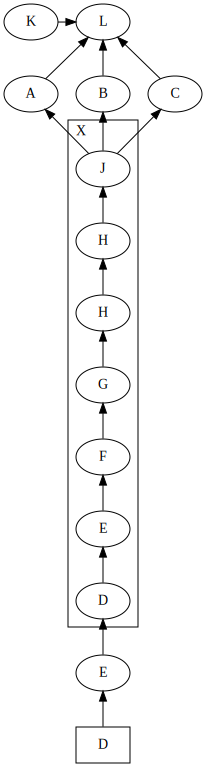

# hornet

Python Graphviz Dot DSL

## Installation

    pip install graphviz-hornet

## Example

### Image
                                                                                                                                                                                    


### Script

```python
from hornet.digraph import Digraph, Cluster, SubGraph
from hornet.node import Node

if __name__ == "__main__":

    with Digraph(
        "graph.svg",
        {
            "rankdir": "BT",
            "newrank": "true",
        },
    ):
        labels = [
            Node("A"),
            Node("B"),
            Node("C"),
        ]
        Node("D", {"shape": "box"}) >> (tfidf := Node("E"))
        with Cluster({"label": "X", "labelloc": "b", "labeljust": "l"}):
            (
                tfidf
                >> Node("D")
                >> Node("E")
                >> Node("F")
                >> Node("G")
                >> Node("H")
                >> Node("H")
                >> Node("J")
                >> labels
            )
        with SubGraph({"rank": "same"}):
            labels + [Node("K")] >> Node("L")
```
